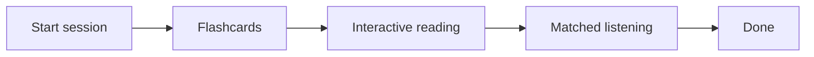
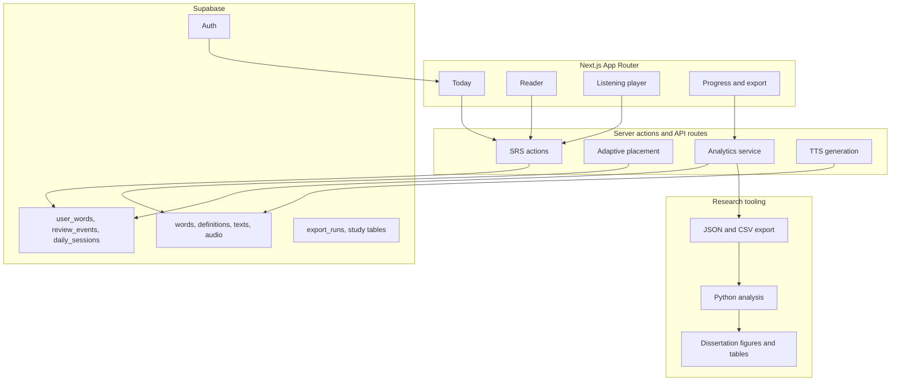
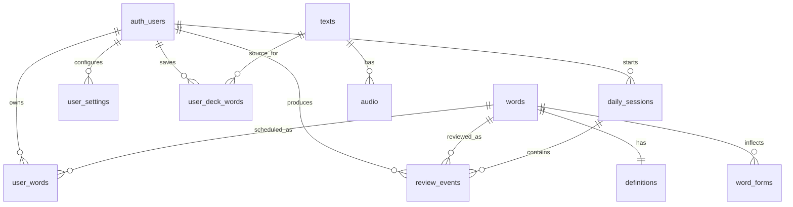

<div align="center">

# Acquisition

A research-informed Spanish learning web app.

[](https://nextjs.org/)
[](https://react.dev/)
[](https://www.typescriptlang.org/)
[](https://supabase.com/)
[](https://tailwindcss.com/)

[Live app](https://languageacquisition.net) · [Dissertation metrics](docs/dissertation-metrics.md) · [Analysis pipeline](analysis/README.md)

</div>

Acquisition is a final-year Computer Science dissertation project at the University of Bristol. It runs one small daily loop: review vocabulary, read a matched Spanish passage, listen to matched audio, stop. No streaks, XP, or guilt framing. The system records enough behaviour to evaluate whether the loop actually works.

**Status.** Pre-launch pilot. Deployed on Vercel.

---

## The daily loop



One session, three linked stages, resumable. Vocabulary introduced in flashcards reappears in the same session's reading passage and listening track. This reflects Nation's argument that deliberate word-card study works best when paired with meaning-focused input.

---

## How it works

### Content pipeline

The app includes a custom Spanish content pipeline for producing level-banded reading, listening, and flashcard material. The production app does not make runtime LLM calls.

The pipeline combines:

- corpus-backed Spanish examples
- controlled vocabulary selection
- CEFR-banded constraints
- template and frame-based sentence construction
- validation checks for level, vocabulary coverage, and formatting
- manual review and correction passes for user-facing content

The lexicon underneath is 35,000+ Spanish lemmas, built from Wiktextract/Kaikki, Helsinki-NLP opus-mt translations, and morphological expansion.

| Module    | Inventory                          |
| --------- | ---------------------------------- |
| Lexicon   | 35,000+ lemmas                     |
| Reader    | 806 passages across A1 to C2       |
| Listening | 955 tracks across A1 to C2         |
| Placement | Item bank scaled to roughly 30,000 |

### Adaptive placement

A short vocabulary-frontier test runs before the first session. Length is dynamic (10 to 26 items) with stopping rules for precision, max items, bottom-out failure, and top-of-bank performance.

The engine is designed to resist lucky guesses. It weights floor modules around vocabulary checkpoints, discounts cognate-heavy answers, and requires morphological evidence for non-cognate support. Onboarding includes a short Zipf's law explanation so the learner understands why a frontier-based test matters.

### Spaced repetition

Flashcards use an FSRS-style stability and difficulty model with an adaptive workload layer on top.

Card types: cloze, normal, MCQ, audio, sentence. Correctness updates scheduling directly; no "again / hard / good / easy" self-grading.

Daily target options:

- **Recommended.** Computed from backlog and accuracy, range 20 to 40.
- **Manual.** 1 to 200, or 1 to 9,999 with an explicit remove-limit toggle. Fulfils in chunks of 50 with prefetch at 10 remaining. Threshold warnings at 251 and 501.

Retries count strictly toward the target. A post-session Practice Complete screen shows stats and offers continuation.

### Reader

A LingQ-style tappable reader with inline tokens that preserve spacing and punctuation. Tapping a word opens a definition panel and a save action that upserts into `user_words` as learning and adds to the manual deck. Known and unknown words are highlighted. A floating listening player is available during reading.

### Listening

Audio synthesised via Google Cloud TTS. Play, pause, seek, transcript show/hide, speed 0.5x to 1.5x. Tracks are matched to the learner's current vocabulary level. Sessions gate on a single listen-through to encourage actual exposure.

---

## Research grounding

The design maps to four lines of empirical work.

| Finding                           | Source                      | Product decision                                                  |
| --------------------------------- | --------------------------- | ----------------------------------------------------------------- |
| Spacing effect                    | Cepeda et al., 2006         | SRS intervals rather than bulk repetition                         |
| Retrieval practice                | Roediger and Karpicke, 2006 | Recall-based cards, not passive flipping                          |
| Multi-strand vocabulary learning  | Nation, 2007                | Flashcards feed matched reading and listening in the same session |
| Task and process-focused feedback | Hattie and Timperley, 2007  | Progress framed as practice and review, not mastery or self-worth |

The app does not claim that words are "learned" or "mastered". Framing throughout is practice, review, and exposure.

---

## Data and analytics

Every meaningful event is recorded. The same server-side metrics bundle feeds both the in-app progress view and the dissertation export.

**Tracked events.** Flashcard attempts with correctness, timing, queue source, queue kind, and retry metadata. Reading completions, saved words, active reading time. Listening completions and listening time. Daily session stage transitions and drop-off.

**Export endpoint.**

```text
/api/progress/export
  ?format=json|csv
  &dataset=all|daily_aggregates|sessions|review_events|reading_events|listening_events|saved_words|export_runs
  &from=YYYY-MM-DD
  &to=YYYY-MM-DD
```

The JSON export includes metadata, metric definitions, summary metrics, daily aggregates, sessions, review events, reading and listening events, saved words, and export logs.

**Reproducibility.** The Python pipeline in `analysis/` consumes an export and produces the dissertation figures and tables.

**Known data-integrity note.** Between 2026-04-11 and 2026-04-15, five session rows across four users have unreliable `assigned_*`, `workload_*`, `learner_*`, and `adaptive_new_word_cap` fields, caused by a now-fixed column-name mismatch (`adaptive_new_word_budget` in code, `adaptive_new_word_cap` in database). These rows are excluded from analyses using those fields. Effort metrics such as completion, attempts, retries, and accuracy are unaffected.

See also: [evaluation measures](docs/dissertation-evaluation-measures.md), [analysis procedure](docs/dissertation-analysis-procedure.md), [threats to validity](docs/dissertation-threats-to-validity.md).

---

## Architecture



### Stack

| Layer     | Technology                                |
| --------- | ----------------------------------------- |
| Framework | Next.js 16 App Router                     |
| UI        | React 19, TypeScript, Tailwind CSS 4      |
| Database  | Supabase Postgres                         |
| Auth      | Supabase Auth with SSR clients            |
| Storage   | Supabase Storage for audio                |
| TTS       | Google Cloud Text-to-Speech               |
| Testing   | Vitest                                    |
| Scripts   | TypeScript via `tsx`, Python for analysis |
| Hosting   | Vercel                                    |

### Data model



### Hot paths

Flashcard submission, Today page loading, reader word lookup, saved-word actions, reading completion, and listening completion are performance-critical. Before changing any of them, read [performance guardrails](docs/performance-guardrails.md) and run `npm run perf:check`.

---

## Repository layout

```text
acquisition/
├── app/          Next.js routes, server actions, API
├── lib/          SRS, placement, analytics, Supabase helpers
├── components/   Reusable UI
├── supabase/    Migrations, seed data
├── scripts/     Import, audio, patching, performance
├── analysis/    Dissertation analysis pipeline (Python)
├── docs/        Evaluation, metrics, operations, performance
└── public/      Static assets and PWA resources
```

---

## Running locally

Intended for dissertation reviewers reproducing the project, not general public use.

```bash
git clone https://github.com/Aftrshock19/acquisition.git
cd acquisition
npm install
cp .env.example .env.local   # fill in Supabase keys
supabase link && supabase db push
npm run seed
npm run dev
```

Required environment variables:

```bash
NEXT_PUBLIC_SUPABASE_URL=
NEXT_PUBLIC_SUPABASE_ANON_KEY=
NEXT_PUBLIC_APP_URL=http://localhost:3000
SUPABASE_SERVICE_ROLE_KEY=          # research and admin flows
RESEARCHER_EMAILS=
APP_SESSION_TIME_ZONE=Europe/London
GOOGLE_APPLICATION_CREDENTIALS=     # audio synthesis only
```

Useful commands:

| Task                      | Command                     |
| ------------------------- | --------------------------- |
| Dev server                | `npm run dev`               |
| Production build          | `npm run build`             |
| Lint                      | `npm run lint`              |
| Tests                     | `npm run test`              |
| Seed vocabulary           | `npm run seed`              |
| Import passages           | `npm run import:passages`   |
| Synthesise TTS audio      | `npm run generate:audio`    |
| Backfill audio duration   | `npm run backfill:duration` |
| Performance guardrail run | `npm run perf:check`        |

---

## Documentation

| Document                                                                | Purpose                                          |
| ----------------------------------------------------------------------- | ------------------------------------------------ |
| [Dissertation metrics](docs/dissertation-metrics.md)                    | Sources of truth, derived metrics, export format |
| [Evaluation measures](docs/dissertation-evaluation-measures.md)         | Operationalised measures for the methodology     |
| [Analysis procedure](docs/dissertation-analysis-procedure.md)           | Export, validation, and analysis workflow        |
| [Results scaffold](docs/dissertation-results-scaffold.md)               | Dissertation results structure                   |
| [Figure and table captions](docs/dissertation-figure-table-captions.md) | Captions for generated outputs                   |
| [Threats to validity](docs/dissertation-threats-to-validity.md)         | Validity risks mapped to implemented measures    |
| [Study operations](docs/study-operations.md)                            | Enrolment, cohort export, researcher access      |
| [Analysis pipeline](analysis/README.md)                                 | Python workflow for figures, tables, reports     |
| [Performance guardrails](docs/performance-guardrails.md)                | Hot-path rules and latency logging               |
| [Hot-path checklist](docs/hot-path-checklist.md)                        | Pre-merge checklist for latency-sensitive code   |

---

## Design principles

Non-negotiable constraints the codebase is held to:

1. **Calm over gamified.** No streaks, XP, owls, or guilt framing.
2. **Low burden over high pressure.** Recommended workloads guide the learner; motivated users are never capped.
3. **Context over isolated recall.** Vocabulary is reused inside reading and listening within the same session.
4. **Honest framing.** No "learned" or "mastered" claims.
5. **Hot paths are features.** Flashcard submission, word lookup, and Today loading have explicit latency guardrails.

---

## Author

Bassam Toughan ([Aftrshock19](https://github.com/Aftrshock19)). BSc Computer Science, University of Bristol.
